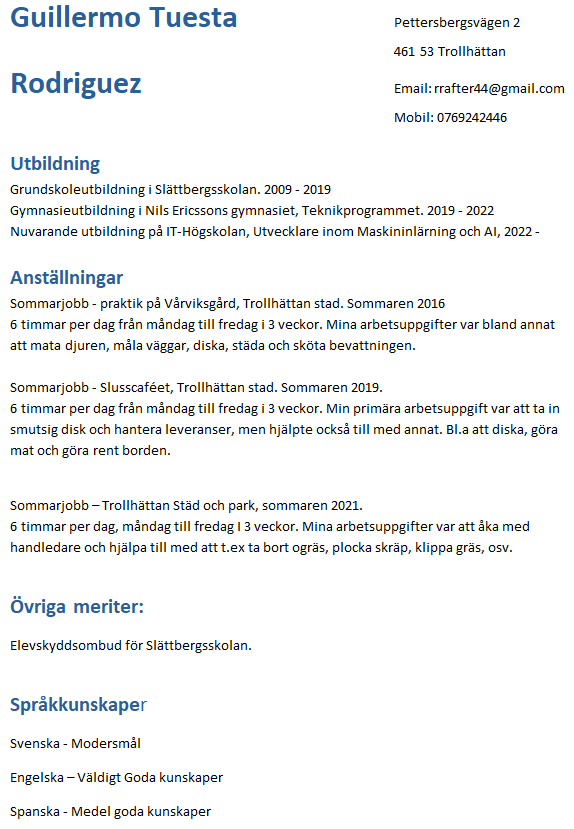

# Guillermo Tuesta Rodriguez 

Student at IT-Högskolan.

---

## GitHub portfolio :briefcase:

| Repo                           | Description                        |
| ------------------------------ | ---------------------------------- |
| [][]            |                |

<!-- | [Programmering 1][prog1]           | first programming course (gymnasiet)   | -->

---

## Deployed applications :desktop_computer:

This is a selection of deployed applications, that I've included in my teaching.

| Application                    | Description                                   |
| ------------------------------ | --------------------------------------------- |
| [][] | [] |

---

## Videos :movie_camera:

This is a selection of video materials that I have produced/participated in (not a full list).

| Video                                 | Description                                  |
| ------------------------------------- | -------------------------------------------- |
| [][]  |  |

---

## Contact me :iphone:

- [: LinkedIn][linkedin]

[linkedin]: https://www.linkedin.com/in/guillermo-tuesta-rodriguez-b89464231/
